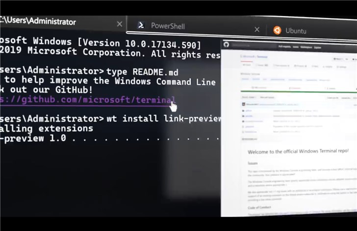

##  Windows Terminal 

## 简介
Windows Terminal 是一个全新的、流行的、功能强大的命令行终端工具。包含很多来社区呼声很高的特性，例如：多 Tab 支持、富文本、多语言支持、可配置、主题和样式，支持 emoji 和基于 GPU 运算的文本渲染等等。

同时该终端依然符合我们的目标和要求，以确保它保持快速、高效，并且不会消耗大量内存和电源。



官网Git：[https://github.com/microsoft/Terminal](https://github.com/microsoft/Terminal)

## 安装

### 环境

Windows操作系统版本必须为1903以上，或者Windows 10 Insider Preview 10.0.18362.30版本

Windows操作系统版本必须为1903以上，或者Windows 10 Insider Preview 10.0.18362.30版本

Windows操作系统版本必须为1903以上，或者Windows 10 Insider Preview 10.0.18362.30版本

重要的事情说三遍

### 安装流程

1、打开Windows PowerShell

2、进入安装包目录执行
```
.\Add-AppDevPackage.ps1
```

## 相关文章

- [微软发布Windows Terminal命令行终端工具：支持多标签、主题](https://www.ithome.com/0/422/546.htm)

- [Windows 全新终端 Windows Terminal](https://blog.csdn.net/mzl87/article/details/89914954)

## 目录

```
.
├── README.md
├── img --> 图片
└── 安装包 --> Windows Terminal安装包
```

## 更新日志

2019年5月9日

    - Windows Terminal 安装包